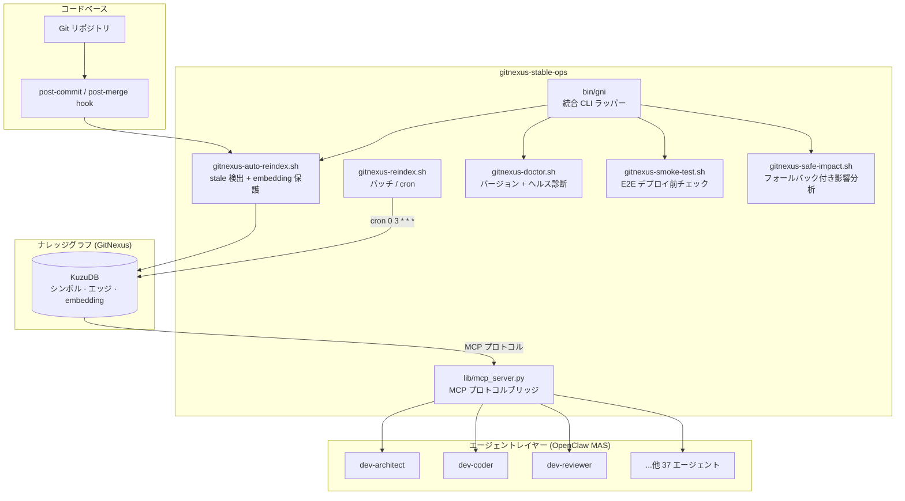

# gitnexus-stable-ops

[English](./README.md) | [中文](./README_zh.md) | **日本語**

[](https://github.com/ShunsukeHayashi/gitnexus-stable-ops/actions)
[](https://github.com/ShunsukeHayashi/gitnexus-stable-ops/stargazers)
[](LICENSE)
[](https://github.com/abhigyanpatwari/GitNexus#community-integrations)

**[GitNexus](https://github.com/abhigyanpatwari/GitNexus) を大規模な本番環境で安定運用するための運用ツールキット — 自律型 AI エージェントスウォームのために設計されています。**

> *「autonomous agent swarms のために設計されている」*
> — [@d3thshot7777](https://github.com/abhigyanpatwari/GitNexus), GitNexus メンテナー

---

## なぜ必要か

GitNexus は強力なコードインテリジェンスエンジンですが、多数のリポジトリを本番環境で運用すると4つの重大な障害モードが露わになります:

| 障害モード | 影響 | このツールキットの解決策 |
|---|---|---|
| **バージョンのずれ** | CLI と MCP が異なる DB を参照 → データ破損 | `$GITNEXUS_BIN` の固定 + デプロイ時スモークテスト |
| **embedding の消失** | `analyze --force` が既存 embedding をサイレント削除 | 既存 embedding を自動検出して保護 |
| **dirty worktree 汚染** | 未コミット変更がナレッジグラフを汚染 | デフォルトでスキップ + `ALLOW_DIRTY_REINDEX` による上書き可 |
| **impact の不安定性** | `impact` コマンドが断続的に失敗 | context ベースのフォールバックで常に有効な JSON を返す |

**v1.0 以降 25 本番リポジトリで embedding 消失ゼロ。**

---

## 本番実績

| 指標 | 数値 |
|---|---|
| インデックス済みリポジトリ数 | **25+** |
| ナレッジグラフのシンボル数 | **32,000+** |
| エッジ（関係）数 | **73,000+** |
| 稼働中の自律 AI エージェント数 | **40** (OpenClaw MAS) |
| embedding 消失インシデント | **0**（v1.0 以降） |
| upstream へのマージ済み PR 数 | **13 件中 7 件**マージ済み |

**[合同会社みやび](https://miyabi-ai.jp)** にて実運用・実証済み — MacBook Pro + Mac Mini ×3 + Windows Gateway を Tailscale VPN メッシュで繋いだ 40 エージェント自律開発環境。

---

## アーキテクチャ



---

## クイックスタート

```bash
# 1. インストール
git clone https://github.com/ShunsukeHayashi/gitnexus-stable-ops.git
cd gitnexus-stable-ops && make install

# 2. リポジトリのヘルスチェック
gni doctor ~/dev/my-repo my-repo

# 3. git フック自動インストール（コミット毎に再インデックス）
make install-hooks REPO=~/dev/my-repo

# 4. エンドツーエンド検証
gni smoke ~/dev/my-repo my-repo MyClassName
```

---

## スクリプト一覧

| スクリプト | 用途 |
|---|---|
| `bin/gni` | 統合 CLI: `gni doctor`, `gni smoke`, `gni impact`, `gni reindex` |
| `bin/gitnexus-doctor.sh` | バージョンずれ診断・MCP 設定検証・インデックス健全性確認 |
| `bin/gitnexus-smoke-test.sh` | フル E2E: analyze → status → list → context → cypher → impact |
| `bin/gitnexus-safe-impact.sh` | context ベースの自動フォールバック付き影響分析 |
| `bin/gitnexus-auto-reindex.sh` | スマート再インデックス: 最新の場合スキップ・embedding 保護 |
| `bin/gitnexus-reindex.sh` | 直近 N 時間で変更されたリポジトリのバッチ再インデックス |
| `bin/gitnexus-reindex-all.sh` | 全登録リポジトリのフル再インデックス |
| `bin/gitnexus-install-hooks.sh` | post-commit/post-merge git フックのインストール |
| `bin/graph-meta-update.sh` | 可視化用クロスコミュニティエッジ JSONL の生成 |

---

## 安全なデフォルト設定

すべてのスクリプトは保守的なデフォルト値を採用:

```bash
ALLOW_DIRTY_REINDEX=0      # 未コミット worktree をスキップ（グラフ汚染防止）
FORCE_REINDEX=0            # meta.json.lastCommit == HEAD の場合スキップ
GITNEXUS_AUTO_REINDEX=1    # git フックはオプトアウト式（オプトイン式ではない）
# embedding 検出は自動 — フラグ指定不要
```

必要な場合のみ上書き:

```bash
ALLOW_DIRTY_REINDEX=1 FORCE_REINDEX=1 bin/gitnexus-auto-reindex.sh
```

---

## cron 連携

```cron
# インクリメンタル再インデックス — 直近 24 時間に変更されたリポジトリ
0 3 * * * cd /path/to/gitnexus-stable-ops && REPOS_DIR=~/dev bin/gitnexus-reindex.sh >> ~/.gitnexus/cron.log 2>&1

# 週次フル再インデックス
0 4 * * 1 cd /path/to/gitnexus-stable-ops && bin/gitnexus-reindex-all.sh >> ~/.gitnexus/cron-full.log 2>&1
```

---

## 環境変数

| 変数 | デフォルト値 | 用途 |
|---|---|---|
| `GITNEXUS_BIN` | `~/.local/bin/gitnexus-stable` | 固定 CLI バイナリ（バージョン分離） |
| `REGISTRY_PATH` | `~/.gitnexus/registry.json` | インデックス済みリポジトリ registry |
| `REPOS_DIR` | `~/dev` | バッチ再インデックスのルート |
| `LOOKBACK_HOURS` | `24` | バッチ再インデックスの遡及時間 |
| `ALLOW_DIRTY_REINDEX` | `0` | dirty worktree 再インデックスを許可 |
| `FORCE_REINDEX` | `1` | スモークテストで強制再インデックス |
| `OUTPUT_DIR` | `./out` | グラフメタ JSONL 出力先 |
| `GITNEXUS_AUTO_REINDEX` | `1` | `0` でフック無効化 |

---

## 動作要件

```
bash 4.0+    git 2.0+    jq 1.6+    python 3.6+
```

| プラットフォーム | 状態 |
|---|---|
| macOS (Apple Silicon / Intel) | ✅ メイン開発プラットフォーム |
| Linux (Ubuntu, Debian, Fedora) | ✅ CI テスト済み |
| Windows WSL2 / Git Bash | ⚠️ コミュニティサポート |

---

## Upstream への貢献

このツールキットは GitNexus を毎日使い込む中で生まれました — 本番環境で発見したエッジケースは upstream への PR として還元しています:

| PR | タイトル | 状態 |
|---|---|---|
| [#441](https://github.com/abhigyanpatwari/GitNexus/pull/441) | 類似度閾値の `confidence` 定数追加 | ✅ マージ済み |
| [#451](https://github.com/abhigyanpatwari/GitNexus/pull/451) | セッション横断チャット履歴の永続化 | ✅ マージ済み |
| [#453](https://github.com/abhigyanpatwari/GitNexus/pull/453) | 構造化デバッグロガーの追加 | ✅ マージ済み |
| [#454](https://github.com/abhigyanpatwari/GitNexus/pull/454) | `detect_changes` に変更タイプ分類を追加 | ✅ マージ済み |
| [#448](https://github.com/abhigyanpatwari/GitNexus/pull/448) | チャットコンテキスト保持の改善 | 🔄 レビュー中 |
| _（+8 件）_ | ドキュメント・バグ修正・エッジケース対応 | 各種 |

**2026 年 3 月時点: 13 PR 提出 → 7 件マージ**。本番運用で見つかったエッジケースが upstream の修正につながります。

---

## ロードマップ

> ロードマップは大規模運用で実際に必要となった機能を反映しています。コントリビューション歓迎。

### v1.3 (2026 Q2)
- [ ] ゼロ依存デプロイ用 Docker イメージ
- [ ] Prometheus メトリクスエンドポイント (`/metrics`)
- [ ] 再インデックス失敗時の Slack/Discord Webhook 通知

### v1.4 (2026 Q3)
- [ ] マルチノード分散再インデックスオーケストレーション
- [ ] GitHub Actions コンポジットアクション (`uses: ShunsukeHayashi/gitnexus-stable-ops@v1`)
- [ ] グラフ健全性可視化ウェブダッシュボード

### v2.0 (2026 Q4)
- [ ] ネイティブ Kubernetes オペレーター
- [ ] エンタープライズ SSO / 監査ログ
- [ ] SLA 付きマネージドサービス

---

## エンタープライズ向け

**大規模・規制環境での GitNexus 運用をお考えの方へ**

合同会社みやびでは以下を提供しています:
- アーキテクチャレビュー & デプロイガイダンス
- CI/CD パイプラインへのカスタム統合
- 優先 Issue 対応

📧 [shunsuke.hayashi@miyabi-ai.jp](mailto:shunsuke.hayashi@miyabi-ai.jp)
🐦 [@The_AGI_WAY](https://x.com/The_AGI_WAY)

---

## ドキュメント

| ドキュメント | 内容 |
|---|---|
| [Runbook](docs/runbook.md) | ステップバイステップの運用手順・障害復旧 |
| [Architecture](docs/architecture.md) | 設計原則・安全保証・データフロー |
| [MCP Integration](docs/mcp-integration.md) | Model Context Protocol によるエージェント接続 |

---

## コントリビューション

```bash
git clone https://github.com/ShunsukeHayashi/gitnexus-stable-ops.git
cd gitnexus-stable-ops
make test
```

- 🐛 [バグ報告](.github/ISSUE_TEMPLATE/bug_report.md)
- 💡 [機能リクエスト](.github/ISSUE_TEMPLATE/feature_request.md)
- すべての PR は `make test` をパスし、[Conventional Commits](https://www.conventionalcommits.org/) に従うこと

詳細は [CONTRIBUTING.md](CONTRIBUTING.md) をご覧ください。

---

## ライセンス

**MIT** — ラッパースクリプト・ツール・ドキュメントのみ対象。

> **重要**: [GitNexus](https://github.com/abhigyanpatwari/GitNexus) 本体は [PolyForm NonCommercial 1.0.0](https://polyformproject.org/licenses/noncommercial/1.0.0/) ライセンスです。このツールキットは GitNexus CLI を呼び出しますが、GitNexus のソースコードを含んでいません。商用利用の前に [GitNexus ライセンス](https://github.com/abhigyanpatwari/GitNexus/blob/main/LICENSE) を確認してください。

---

**[合同会社みやび](https://miyabi-ai.jp)** が開発 · [@The_AGI_WAY](https://x.com/The_AGI_WAY)

役に立ったら ⭐ Star をお願いします！
